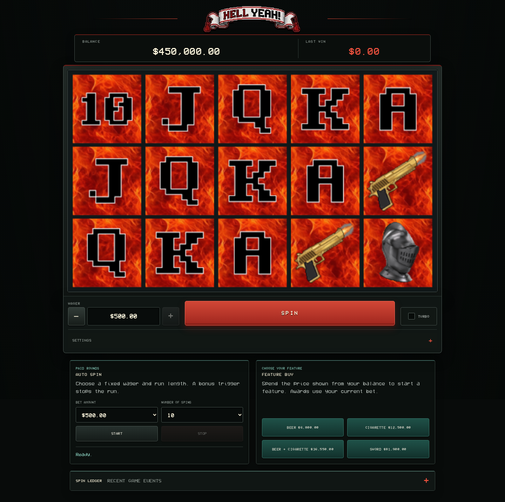
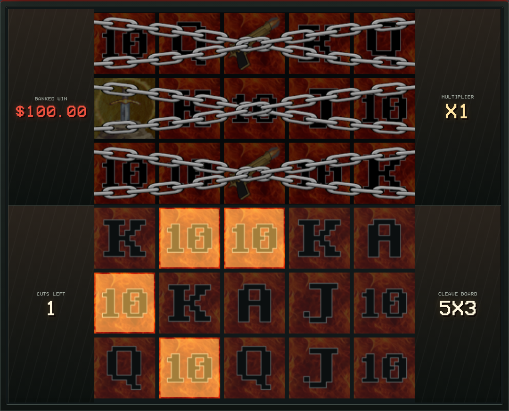

# Hell Yeah

Hell Yeah is a browser slot game built with **TypeScript, PixiJS, and Vite**. Its five reel strips, left-to-right ways payouts, and four interconnected features share the same game math with a reproducible, headless simulator. The artwork, background video, and audio were made for this project.



## Try it

Requires Node.js `^20.19.0` or `>=22.12.0` and npm. To play locally:

```bash
npm ci
npm run dev
```

Open the URL printed by Vite. To try the **production build** instead:

```bash
npm run build
npm run preview
```

`build` type-checks and writes the site to `dist/`; `preview` serves those built files locally (usually on port 4173).

The displayed dollar amounts are virtual game balance and wagers. Hell Yeah has no accounts, payments, backend, persistence, or real-money play. Reloading resets the session; Reset returns the balance to `$450,000.00` and the bet to `$500.00`.

## What it demonstrates

- **Outcome-first architecture:** five 64-stop reel strips determine a 3×5 result; ways evaluation, WILD substitution, feature triggers, cash prizes, and capped payouts resolve independently of PixiJS animation.
- **Connected features:** BEER free spins, CIGARETTE cash awards, a combined mode with retriggers, and Sword Cleave's expanding 5×6 board and possible Final Strike.
- **Exact accounting:** wagers, balances, and awards use integer cents; paytable multipliers use integer tenths; a paid or purchased round has a 10,000×-bet payout ceiling.
- **Two randomness paths:** browser play uses Web Crypto; the Node simulator uses a seeded source with the same math and configuration to reproduce runs. Visual-only scrolling never selects outcomes.
- **Player experience:** Turbo, manual Settle, Auto Spin, feature buys, keyboard-operable feature and payout prompts, responsive controls, audio settings, and reduced-motion behavior.



BEER and CIGARETTE initially award eight free spins (BEER and combined start at x3). Sword Cleave starts with three spins and three unlocked rows; an in-play Sword adds three spins and unlocks another row. Feature Buy deducts its displayed price from the virtual balance, then plays a qualifying spin before the feature starts. Its prices target approximately 98% purchased-round RTP by design, **not** a guaranteed result. For paytables, trigger priorities, retrigger order, cash ladders, and payout accounting, see [Game Rules and Edge Cases](docs/Edge-Cases.md).

## Project map

| Path | Role |
| --- | --- |
| `src/config/` | Reel strips, paytables, bonus configuration, bet and timing settings |
| `src/math/` | DOM-free random sources, reel generation, payout and feature engines |
| `src/core/` | Game state, types, and browser round orchestration |
| `src/presentation/` | PixiJS reels and Sword board, controls, overlays, audio |
| `src/simulation/` | Node-only analysis and seeded simulation |
| `src/tests/` | Unit tests for math and presentation behavior |

See [Code Structure](docs/CODE_STRUCTURE.md) for a guided walkthrough. Normal browser play has no seed controls. `npm run dev` alone shows no-wager feature triggers for development; the production build omits their panel and independently rejects forced triggers in the controller.

## Verify and explore the math

| Command | Purpose |
| --- | --- |
<<<<<<< HEAD
| `npm run test` | Run the Vitest suite |
| `npm run build` | Type-check and build production assets |
| `npm run analyze` | Calculate exact base-game ways RTP by symbol and match length |
| `npm run simulate -- --spins=100000 --seed=12345` | Repeat a seeded sample of paid rounds, including triggered features |
| `npm run simulate -- --spins=250000 --seed=buy-check --feature=combined` | Sample a purchased feature at its configured price |
=======
| `npm run dev` | Start the Vite development server |
| `npm run test` | Run the Vitest unit suite once |
| `npm run analyze` | Calculate exact base-game RTP by symbol and match length |
| `npm run simulate` | Simulate 100,000 paid spins with seed `12345` |
| `npm run build` | Type-check and create the production bundle |
>>>>>>> origin/main

`--feature` accepts `beer`, `cigarette`, `combined`, or `sword`; the default run uses 100,000 paid spins and seed `12345`. The report separates base, free-spin, and Sword contributions and counts retriggers and expansions. The game targets approximately 98% natural-play RTP, but rare outcomes make short samples volatile. Simulation results are observations, **not** certification, confidence intervals, or guarantees.

<<<<<<< HEAD
## Accessibility and assets

The game provides a skip link, status announcements, text descriptions of visible canvas symbols, keyboard-operable feature starts and large-win dismissal, and a reduced-motion path that avoids reel scrolling, payout count-ups, and background-video playback.
=======
```bash
npm run simulate -- --spins=1000000 --seed=my-seed
npm run simulate -- --spins=250000 --seed=buy-check --feature=combined
```

`--spins` must be a positive safe integer. `--seed` must be non-empty. `--feature` can be `beer`, `cigarette`, `combined`, or `sword` to simulate purchased rounds at their configured price. Triggered free spins are completed in addition to the requested rounds.
>>>>>>> origin/main

The symbol art, logos, background video, and audio were created by the project author. The bundled [VCR OSD Mono font by Riciery Leal](https://www.dafont.com/vcr-osd-mono.font) is a third-party asset listed on DaFont as “100% Free”; its rights belong to its creator. Graphics and font files are under `graphics/`, and audio is under `audio/`; runtime assets are bundled locally rather than fetched from a CDN.

## Rights and limitations

<<<<<<< HEAD
**All rights reserved.** This repository is `UNLICENSED`: its source and original assets are available to view, but no permission is granted to use, copy, modify, or redistribute them. The third-party font is credited separately above. This game is not certified gambling software and must not be used for real-money gambling. There is no persistent save, account system, or independently certified statistical analysis.
=======
- **Spin** places the selected US-dollar wager and plays one complete paid round. While a base, free, or Sword spin is animating, the button becomes **Settle** and immediately shows that already-resolved spin.
- **- / +** moves through the configured bets: `$0.20`, `$0.40`, `$0.60`, `$0.80`, `$1.00`, `$1.20`, `$1.40`, `$1.60`, `$1.80`, `$2.00`, `$2.50`, `$3.00`, `$5.00`, `$10.00`, `$25.00`, `$50.00`, `$75.00`, `$100.00`, `$150.00`, `$200.00`, `$250.00`, `$300.00`, `$400.00`, and `$500.00`.
- **Turbo** shortens the current and future spin animations without changing results. It can be toggled during spins and bonus games; a qualifying spin remains in Turbo through its settlement, then Turbo turns off before the feature-start prompt.
- **Music On / Music Off** and **SFX On / SFX Off** control the soundtrack and sound effects independently. Both are enabled by default. Bonus-symbol columns replace the normal reel-lock click with symbol-specific first, second, and third hit sounds; an individual feature's third hit also plays its win sound. A combined Beer + Cigarette trigger plays its own stinger after the reels settle, and the large-win count-up loops its sound until dismissed.
- **Reset** restores a `$450,000.00` balance and a `$500.00` bet and clears prior Spin Ledger entries.
- **Auto Spin** runs 10, 25, 50, 100, or a custom 1-1,000 paid spins at its selected fixed bet. Stop finishes the current resolved spin and leaves the unused count visible. A bonus trigger ends Auto Spin after its triggering paid spin and leaves the normal feature-start prompt active. Base-game large-win count-ups finish automatically and continue the run.
- **Spin Ledger** is an optional, collapsed-by-default dropdown containing the 30 most recent game events. Reset removes its prior history and records the reset.
- **Feature Buy** first plays a qualifying spin showing one purchased bonus symbol per selected column, awards any ordinary ways win from that spin, and then waits for `Press to Start ... Feature`. Combined buys randomly show either three BEER and two CIGARETTE or two BEER and three CIGARETTE. BEER costs 13.6x bet, CIGARETTE costs 25x, BEER + CIGARETTE costs 73.1x, and SWORD costs 163.8x. Each price targets approximately 98% purchased-round RTP.
- Ways wins and completed feature payouts of at least 5x their triggering bet show a large payout count-up: `BIG WIN!` at 5x-9.99x, `HUGE WIN!` at 10x-24.99x, `SUPER WIN!` at 25x-49.99x, and `HELL YEAH!` at 50x or more. Feature completions do not display an interim summary panel; qualifying payouts transition directly to this count-up. Once the count completes, the final payout remains until the player clicks or taps the game window to continue.

Bet, wager, reset, Auto Spin configuration, and feature-buy controls are disabled while a round or feature is running. Auto Spin also locks manual bet and Feature Buy controls for its run; its Stop control remains available. Settle and Turbo remain available where described above.

## Accessibility

- A keyboard-accessible skip link moves directly to the game controls.
- Status changes, feature announcements, and the Spin Ledger use live regions where appropriate.
- The PixiJS reel and Sword canvases expose text alternatives that update with their visible symbols.

## Game Overview

Regular symbols `10`, `J`, `Q`, `K`, `A`, `GUN`, and `KNIGHT` pay left to right from the first reel. `GUN` ranks directly above `A`, and `KNIGHT` is the highest-paying regular symbol. `WILD` substitutes for regular symbols. `BEER`, `CIGARETTE`, and `SWORD` are non-paying special symbols.

| Symbol | 3 columns | 4 columns | 5 columns |
| --- | ---: | ---: | ---: |
| `10` | - | x0.1 | x0.3 |
| `J` | - | x0.2 | x0.5 |
| `Q` | x0.2 | x0.3 | x0.7 |
| `K` | x0.3 | x0.5 | x0.8 |
| `A` | x0.5 | x1 | x4.5 |
| `GUN` | x0.8 | x2.4 | x12 |
| `KNIGHT` | x1.5 | x4.5 | x24 |

| Feature | Initial award |
| --- | --- |
| BEER | 8 free spins at x3 |
| CIGARETTE | 8 free spins at x1; each CIGARETTE selects a weighted cash prize |
| BEER + CIGARETTE | 8 free spins at x3; BEER and CIGARETTE prizes are each multiplied by x3 |
| SWORD | Sword Cleave: expanding 5-column respins, stage multipliers, and a possible Final Strike |

Each spinning column can show at most one BEER, CIGARETTE, or SWORD, and a grid can show at most three matching copies of one type. BEER and CIGARETTE features require three matching symbols. A combined feature requires all five columns to show BEER/CIGARETTE symbols split 3+2 in either direction. Cash prizes use weighted ladders, so x0.5 and x1 values are common while x25 BEER and x50 CIGARETTE values are rare. Three BEER or three CIGARETTE symbols add 5 spins. A feature converts to combined when the opposite symbol retriggers; x3 combined behavior begins on the following spin. SWORD takes priority when outcomes overlap.

Sword Cleave displays a 5x6 board with its bottom three rows initially unlocked. Covered rows still resolve symbols but cannot pay or trigger an award until an expansion unlocks them upward. Its boards use `10`, `J`, `Q`, `K`, `A`, GUN, KNIGHT, WILD, and at most one SWORD. Before a spin with three, four, or five unlocked rows, an in-play Sword expansion has a 40%, 25%, and 10% chance respectively. Each expansion adds three spins and replaces the active multiplier with the destination band: 5x4 x2-x3, 5x5 x3-x5, or 5x6 x5-x8. The complete paid or purchased round, including every feature, is capped at x10,000 the selected bet.

Cash-symbol awards materially affect RTP. Use the seeded simulator to review the result after changing award ranges, reel strips, or feature rules; it is not a statistical or regulatory certification.

See [Game Rules and Edge Cases](Edge-Cases.md) for the authoritative paytable, trigger probabilities, retrigger order, WILD treatment, SWORD priority, and round-accounting rules.

## Randomness and Deterministic Simulation

Browser play always uses Web Crypto and exposes no seed control. The headless simulator uses `SeededRandomSource` so math runs can be repeated with `--seed`.

Simulator reproduction depends on the same seed, code, configuration, and spin count. Reel stops, free spins, landed cash awards, Sword checks and targets, Sword board cells, stage multipliers, and Final Strikes consume the shared simulator sequence. Presentation-only scrolling cash values are browser-only and do not consume outcome randomness.

The seeded generator is intended for repeatability, not cryptographic security.

## Development Controls

`npm run dev` creates a separate service panel for forcing BEER, CIGARETTE, combined, and SWORD features. The production bundle does not create or include that panel, and the controller independently rejects forced triggers outside Vite development mode. Each development action plays the same qualifying-symbol spin as its Feature Buy counterpart, places no wager, credits any ordinary ways win at the selected bet, consumes browser Web Crypto randomness normally, and waits for the same manual start prompt. Production Feature Buy controls always charge the displayed in-game balance price.

## Project Layout

```text
src/
  config/         Game settings, paytable, and reel strips
  core/           Domain types, state, and browser orchestration
  math/           Random sources, reel generation, payouts, and bonus rules
  presentation/   PixiJS rendering, controls, animation, and audio
  simulation/     Node-compatible headless simulation
  tests/          Math-focused unit tests
  main.ts         Browser entry point
```

Symbol artwork, the top-bar logo, `BG_VIDEO.mp4`, and `VCR_OSD_MONO_1.001.ttf` are stored in `graphics/`; audio is stored in `audio/`. Vite bundles all runtime assets through module URL and CSS imports; the prototype uses no runtime CDN or external asset service.

## Current Limitations

- The game targets approximately 98% theoretical RTP but has not been independently balanced or certified.
- Sword Cleave's rare Final Strike paths make short simulations highly volatile.
- There is no persistence, backend, or account system.
- Refreshing the page resets the balance and Auto Spin state.
- Browser automation, visual-regression testing, and formal statistical analysis are not included.

## License

This repository is `UNLICENSED`. Its source and assets are provided for viewing only; no permission is granted to use, copy, modify, or distribute them.

## Disclaimer

This project is for local development and education only. It is not certified gambling software, has not undergone regulatory or statistical certification, and must not be used for real-money gambling.
>>>>>>> origin/main
